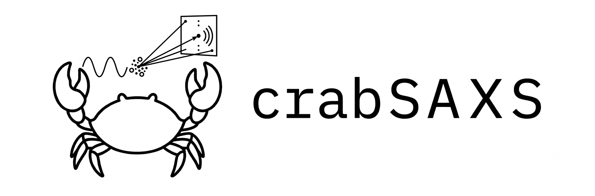

# CrabSAXS

[](https://crates.io/crates/crabsaxs)
[](https://docs.rs/crabsaxs)
[](https://github.com/Ojas-Singh/crabSAXS/actions/workflows/ci.yml)
[](LICENSE)
[](https://github.com/Ojas-Singh/crabSAXS/releases)



CrabSAXS is an independent Rust implementation of theoretical small-angle
X-ray scattering (SAXS) calculations, experimental fitting, and ensemble
population scoring from PDB/mmCIF atomic structures. The Debye calculation is
the correctness reference; a parallel spherical-multipole implementation is
the fast path. The method is based on the open literature cited in
[`docs/REFERENCES.md`](docs/REFERENCES.md).

## Install

```sh
cargo install crabsaxs --locked
```

The command is `crabsaxs`; the Rust library is also named `crabsaxs`.

## Quick start

```sh
crabsaxs calc structure.pdb --q-min 0.005 --q-max 0.5 --q-step 0.005
crabsaxs fit structure.pdb experiment.dat --quality balanced
crabsaxs score structure.pdb experiment.dat --quiet --format json
crabsaxs ensemble conformers/*.pdb --experiment experiment.dat --fit-weights
```

`calc` writes a derived `structure.saxs.dat` file. `fit` and `ensemble` write
report directories containing curves, residuals, JSON results, and text
summaries. Existing outputs are protected; use `--force` intentionally.

Experimental data may be `q I` or `q I sigma`, separated by whitespace or
commas. Values are interpreted as Å⁻¹ by default. Headers containing `nm` are
recognized, and the inferred convention is recorded in machine-readable
reports.

## Commands

| Command | Purpose |
| --- | --- |
| `calc` | Calculate a theoretical curve. |
| `fit` | Fit scale, background, solvent parameters, and a structure to data. |
| `score` | Reuse a parsed experimental curve for structure screening. |
| `ensemble` | Fit non-negative conformer populations with shared solvent terms. |
| `batch` | Score or summarize many structures. |
| `inspect` | Report structure composition or experimental-data diagnostics. |
| `compare` | Calculate χ², correlation, R-factor, and residual statistics. |
| `info` | Show version, algorithms, and runtime information. |

Use `crabsaxs <command> --help` for all options. Global options include
`--threads`, `--seed`, `--format`, `--config`, `--write-config`, `--quiet`,
`--verbose`, and `--force`. Configuration values are applied before explicit
CLI options.

## Library API

The high-level API is intentionally small:

```rust,no_run
use crabsaxs::{ExperimentalCurve, FitOptions, SaxsFitter};

// Load these from PDB/mmCIF and a data file in an application.
# let structure = crabsaxs::Structure::default();
# let experimental = ExperimentalCurve { q: vec![0.01], intensity: vec![1.0], sigma: vec![1.0], has_errors: true };
let fitter = SaxsFitter::new(FitOptions::default());
let result = fitter.fit(&structure, &experimental)?;
# Ok::<(), crabsaxs::SaxsError>(())
```

`ProfileCalculator`, `SaxsScorer`, and `EnsembleFitter` provide reusable
calculation boundaries for Rust applications such as ReGlyco.

## Validation and development

```sh
cargo fmt --all -- --check
cargo clippy --all-targets --all-features -- -D warnings
cargo test --all --all-features
cargo doc --no-deps
cargo build --release --locked
```

The committed benchmark and parity reports are machine-specific. Pepsi-SAXS
is used only as an approved black-box validation target; no private
implementation details are used.

## License

MIT. See [`LICENSE`](LICENSE).
